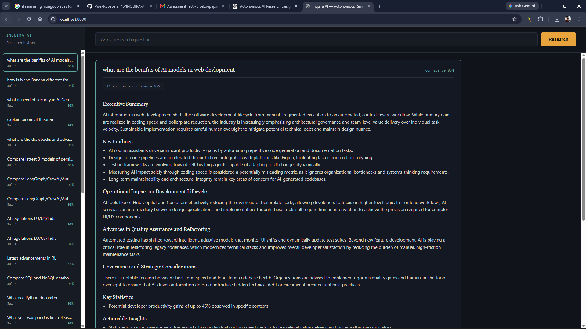

# Inquira AI

> **Autonomous Research. Verified Insights.**

An autonomous AI research agent that independently plans research, selects the most appropriate external tools, gathers evidence from multiple sources in parallel, validates and ranks findings, reasons over the collected information, and produces structured reports with verifiable citations.

> **Built for:** Autonomous Research Agent Assessment

---

## Highlights

- **Autonomous planning** using an LLM (no hardcoded workflows)
- **Dynamic tool selection** based on research objectives
- **Parallel information gathering** across multiple sources
- **Evidence deduplication**, ranking, and relevance filtering
- **Confidence-driven iterative research loop** using LangGraph
- **Structured reports** with grounded citations
- **Markdown & PDF export**
- **SQLite-backed research memory**

---

## Assessment Compliance

| Requirement | Status | Where / Details |
| :--- | :---: | :--- |
| **Accept research query** | ✅ | `ResearchRequest`, frontend input |
| **Search external sources** | ✅ | Tavily (web) + ArXiv (papers) + Scraper (specific URLs), planner-selected |
| **Extract relevant information** | ✅ | Full page text via Tavily's raw content, not just short snippets |
| **Remove duplicate content** | ✅ | Text-similarity dedup (`evidence.py`) |
| **Remove irrelevant content** | ✅ | Relevance-floor filtering with a safety fallback against over-filtering |
| **Generate structured summary** | ✅ | `ResearchReport` schema — key points, findings, and insights |
| **References / citations** | ✅ | References pulled directly from evidence, never LLM-invented |
| **Actionable insights** | ✅ | Built directly into the structured output report |
| **Autonomous tool selection** | ✅ | Planner receives only tool *descriptions*, decides selection itself — no keyword matching |
| **Parallel information gathering** | ✅ | Concurrent across tools **and** sub-questions (`asyncio.gather`) |
| **PDF export** | ✅ | In-memory generation, streamed directly to the browser |
| **Markdown export** | ✅ | In-memory generation, streamed directly to the browser |
| **Store previous research** | ✅ | SQLite-backed; actively reused as optional context for the planner |

### Engineering Principles

- **No hardcoded responses**
- **No keyword-based routing**
- **No predefined decision trees**
- **LLM-driven planning and reasoning**
- **Evidence-backed report generation**
- **Production-oriented modular architecture**

---

## Why This Is an Autonomous Agent

Unlike a traditional chatbot that directly generates an answer from a prompt, Inquira AI follows an autonomous research workflow.

1. **Plans** the research objective.
2. **Determines** what information is required.
3. **Selects** appropriate external tools.
4. **Collects** evidence concurrently.
5. **Removes** duplicate and irrelevant information.
6. **Evaluates** evidence quality.
7. **Reasons** over agreements and contradictions.
8. **Generates** a structured report with citations.

Every major decision is made dynamically by the LLM through LangGraph rather than hardcoded rules.

---

## System Architecture

Built with **LangGraph** as a `StateGraph`, not a linear chain. The planner's tool selection and the reasoner's confidence score are LLM decisions that dynamically change control flow, demonstrating true operational autonomy.

### Workflow
## System Workflow

The following workflow illustrates how **Inquira AI** autonomously researches a topic, gathers evidence, reasons over the collected information, and generates a structured report.

```text
                               User Query
                                    │
                                    ▼
                    ┌─────────────────────────────────┐
                    │            Planner              │
                    │ • Understand research objective │
                    │ • Define scope                  │
                    │ • Generate sub-questions        │
                    │ • Select research tools         │
                    │ • Retrieve relevant memory      │
                    └───────────────┬─────────────────┘
                                    │
                                    ▼
                 ┌─────────────────────────────────────┐
                 │        Parallel Tool Executor       │
                 │                                     │
                 │  • Tavily Search                    │
                 │  • ArXiv Papers                     │
                 │  • Website Scraper                  │
                 │                                     │
                 │ Executes selected tools             │
                 │ concurrently across multiple        │
                 │ research sub-questions              │
                 └───────────────┬─────────────────────┘
                                 │
                                 ▼
                  ┌──────────────────────────────────┐
                  │      Evidence Processing          │
                  │                                  │
                  │ • Remove duplicates              │
                  │ • Rank by source reliability     │
                  │ • Filter irrelevant evidence     │
                  └───────────────┬──────────────────┘
                                  │
                                  ▼
                  ┌──────────────────────────────────┐
                  │          Reasoner Agent          │
                  │                                  │
                  │ • Detect agreements              │
                  │ • Detect contradictions          │
                  │ • Measure uncertainty            │
                  │ • Calculate confidence score     │
                  └───────────────┬──────────────────┘
                                  │
             confidence < threshold │
            & iterations < max      │
                                  ▼
                   ┌────────────────────────────┐
                   │ Continue Research          │
                   │                            │
                   │ Search the NEXT batch of   │
                   │ sub-questions using the    │
                   │ selected research tools    │
                   └──────────────┬─────────────┘
                                  │
                                  └───────────────┐
                                                  │
                                                  ▼
                                      Parallel Tool Executor

If confidence is sufficient
or maximum iterations reached
                │
                ▼
      ┌────────────────────────────────────┐
      │        Report Generator            │
      │                                    │
      │ • Executive Summary                │
      │ • Key Findings                     │
      │ • Detailed Analysis                │
      │ • References                       │
      │ • Actionable Insights              │
      │ • Confidence Score                 │
      └───────────────┬────────────────────┘
                      │
                      ▼
      ┌────────────────────────────────────┐
      │     SQLite Memory & History        │
      │                                    │
      │ • Store research query             │
      │ • Store generated report           │
      │ • Store references                 │
      │ • Enable report reopening          │
      │ • Provide context for future       │
      │   research sessions                │
      └────────────────────────────────────┘
```

### Workflow Summary

1. **User submits a research query.**
2. The **Planner Agent** determines the research objective, decomposes the task into sub-questions, retrieves relevant past research, and autonomously selects the most appropriate research tools.
3. The **Tool Executor** gathers information concurrently from multiple external sources (Tavily, ArXiv, and Web Scraper).
4. Retrieved evidence is **deduplicated, ranked, and filtered** before reasoning.
5. The **Reasoner Agent** evaluates agreements, contradictions, uncertainty, and produces a confidence score.
6. If confidence is below the configured threshold, the workflow loops back to the Tool Executor and researches the **next batch of sub-questions** instead of repeating previous searches.
7. Once sufficient confidence is achieved, the **Report Generator** creates a structured research report with grounded citations.
8. The completed report and metadata are stored in **SQLite**, allowing users to reopen previous research and providing optional context for future planning.

### Visual Diagram


#### Sub-question batching (the fix that mattered most)
Early versions of this project only ever searched `sub_questions[0]`, silently discarding the rest of what the planner decomposed — a "compare 3 frameworks" query would only ever search framework #1, leaving the report with real, admitted gaps for the others. The fix: `tool_executor_node` tracks a `subquestion_offset` in graph state and searches a *batch* of sub-questions each pass (capped by `MAX_SUBQUESTIONS_PER_BATCH`, default 3). When the confidence-loop fires, the retry naturally searches the *next* batch — new information, not a repeat of the same query. Verified end-to-end: a 3-jurisdiction regulation query went from two "insufficient data" gaps and 0.30 confidence to full coverage of all three jurisdictions at 0.90 confidence, using the identical model and query, changing only this mechanism.

---

## Features

- **Autonomous research planning**
- **Dynamic tool selection**
- **Parallel search execution**
- **Multi-source evidence collection**
- **Evidence deduplication**
- **Source reliability ranking**
- **Confidence-based reasoning**
- **Structured reports**
- **Markdown export**
- **PDF export**
- **Research history**

---

## Technology Stack

| Layer | Technology |
| :--- | :--- |
| **Backend** | FastAPI |
| **Agent Framework** | LangGraph |
| **LLM** | Gemini |
| **Search** | Tavily |
| **Research Sources** | Tavily, ArXiv, Website Scraper |
| **HTTP Client** | httpx |
| **HTML Parsing** | BeautifulSoup |
| **Memory** | SQLite |
| **Validation** | Pydantic |
| **Async** | asyncio |
| **Reports** | Markdown, ReportLab |
| **Frontend** | HTML, CSS, JavaScript |

---

## Project Structure

```text
app/
├── main.py                          # FastAPI application entry point and lifespan events
├── config.py                        # Typed application settings loaded from .env
│
├── api/
│   └── routes.py                    # REST API endpoints:
│                                    # /research
│                                    # /research/stream (SSE)
│                                    # /memory/recent
│                                    # /memory/{id}
│                                    # /export/{markdown|pdf}
│
├── agents/
│   ├── state.py                     # Shared LangGraph state (TypedDict)
│   ├── graph.py                     # LangGraph workflow and conditional routing
│   ├── planner.py                   # Autonomous research planning & tool selection
│   ├── tool_executor.py             # Parallel execution across tools and sub-questions
│   ├── evidence.py                  # Evidence deduplication, ranking & filtering
│   ├── reasoner.py                  # Agreement, contradiction & confidence analysis
│   ├── report_generator.py          # Structured report generation with grounded citations
│   └── prompts.py                   # Centralized prompt templates
│
├── tools/
│   ├── base.py                      # Abstract ResearchTool interface
│   ├── tavily.py                    # Tavily Search integration
│   ├── arxiv.py                     # ArXiv research integration
│   └── scraper.py                   # Website content extraction
│
├── services/
│   ├── llm_client.py                # Provider-agnostic LLM client (Gemini/OpenAI)
│   ├── memory_service.py            # SQLite storage & similarity-based retrieval
│   └── report_service.py            # In-memory Markdown & PDF generation
│
├── models/
│   └── schemas.py                   # Pydantic request/response and internal schemas
│
└── utils/
    └── logger.py                    # Centralized application logging

frontend/
├── index.html                       # Application layout
├── styles.css                       # Responsive UI styling
└── app.js                           # Client logic, SSE streaming, history & exports
```
---

## Installation & Setup

### 1. Clone the Repository

```bash
git clone <repository-url>
cd inquira-ai
```

---

### 2. Create a Virtual Environment

```bash
python -m venv .venv
```

---

### 3. Activate the Virtual Environment

**Windows**

```bash
.venv\Scripts\activate
```

**Linux / macOS**

```bash
source .venv/bin/activate
```

---

### 4. Install Dependencies

```bash
pip install -r requirements.txt
```

---

### 5. Configure Environment Variables

Create a local environment file:

```bash
cp .env.example .env
```

Update the required credentials in `.env`:

| Variable | Required | Description |
|----------|:--------:|-------------|
| `GEMINI_API_KEY` | ✅ | Gemini API Key (Get one free from https://aistudio.google.com/apikey) |
| `TAVILY_API_KEY` | ✅ | Tavily Search API Key (Free tier available at https://tavily.com) |
| `GEMINI_MODEL` | ❌ | Optional Gemini model identifier (defaults can be used if omitted) |

> **Note:** Gemini free-tier quotas vary by model and may change over time. If you encounter a `429 RESOURCE_EXHAUSTED` error, check your available quota in Google AI Studio and consider switching the `GEMINI_MODEL` value in `.env` to another supported model with higher remaining quota. No code changes are required.

---

### 6. Run the Application

```bash
python run.py
```

Once the server starts, open your browser and navigate to:

```text
http://localhost:8000
```

---

## Example Research Report

After the autonomous research workflow completes, Inquira AI generates a structured, evidence-based report containing:

- 📌 Executive Summary
- 🔍 Key Findings
- 📖 Detailed Analysis
- 📊 Confidence Assessment & Contradictions
- 🔗 References & Citations
- 💡 Actionable Insights

### Sample Output


---

## API Endpoints

| Method | Endpoint | Description |
|--------|----------|-------------|
| `POST` | `/api/research/stream` | Streams live research progress using Server-Sent Events (SSE) and returns the final structured research report. Request body: `{"query": "..."}` |
| `POST` | `/api/research` | Performs synchronous research and returns the completed report as JSON. |
| `GET` | `/api/memory/recent?limit=10` | Retrieves the most recent research history (summaries only). |
| `GET` | `/api/memory/{id}` | Retrieves a previously stored research report from SQLite, enabling users to reopen reports without re-running research. |
| `POST` | `/api/export/{markdown\|pdf}` | Generates and streams the research report as either Markdown or PDF. The request body contains the report JSON returned from the research endpoint. |

---

## Engineering Decisions

| Decision | Reasoning |
|-----------|-----------|
| **LLM-driven tool selection** | The planner autonomously selects research tools based on the user's objective and tool descriptions. This avoids hardcoded keyword matching and demonstrates genuine agentic behavior. |
| **Text-similarity deduplication (`difflib`)** | At the current project scale (typically 5–15 evidence items), lexical similarity provides sufficient quality while keeping the implementation lightweight. Embedding-based similarity is planned for future scalability. |
| **Safe relevance filtering** | If relevance filtering would eliminate all collected evidence, the system automatically falls back to the original evidence set. Returning a lower-confidence report is preferable to returning no report at all. |
| **Grounded citations only** | Every reference included in the final report is extracted directly from retrieved evidence. The LLM never generates citations independently, eliminating hallucinated references. |
| **Sub-question batching using offsets** | A `subquestion_offset` tracks research progress, ensuring each iteration explores new sub-questions rather than repeating previous searches. This provides broader coverage without duplicate bookkeeping. |
| **Memory is advisory** | Previous research retrieved from SQLite is provided as optional context. The planner independently determines whether the stored research is relevant instead of blindly reusing it. |
| **In-memory report export** | Reports are generated directly in memory and streamed to the client. SQLite remains the single source of truth, avoiding redundant server-side report files. |
| **SQLite with raw `aiosqlite`** | SQLite is intentionally used for lightweight persistence suitable for the assessment. Using a full ORM would introduce unnecessary complexity for the current scope. |
| **SSE instead of WebSockets** | Research progress only requires one-way server-to-client communication. Server-Sent Events provide a simpler and more efficient solution than maintaining bidirectional WebSocket connections. |
| **Targeted retry strategy** | Automatic retries are limited to transient failures such as HTTP `429` and `5xx` responses. Permanent failures (e.g., invalid API keys) fail immediately to avoid unnecessary retry attempts. |

---

## Future Enhancements

- **Streamlit deployment** to provide an alternative interactive interface for demonstrating the autonomous research workflow.
- **MongoDB Atlas integration** for scalable persistence and future production deployments.
- **Embedding-based semantic similarity** for evidence deduplication and memory retrieval, improving handling of paraphrased content.
- **Automated testing suite** using `pytest` for comprehensive unit, integration, and end-to-end validation.
- **Configurable research parameters**, allowing users to tune `MAX_SUBQUESTIONS_PER_BATCH`, confidence thresholds, and research depth based on latency and API usage requirements.

---

## Roadmap

- Streamlit deployment
- MongoDB Atlas migration
- Embedding-based semantic memory retrieval
- Additional external research tools
- Multi-user support
- Advanced report visualizations and analytics

---

## License

This project was developed as part of an **AI Automation Engineer Assessment** and is intended for educational, demonstration, and portfolio purposes.